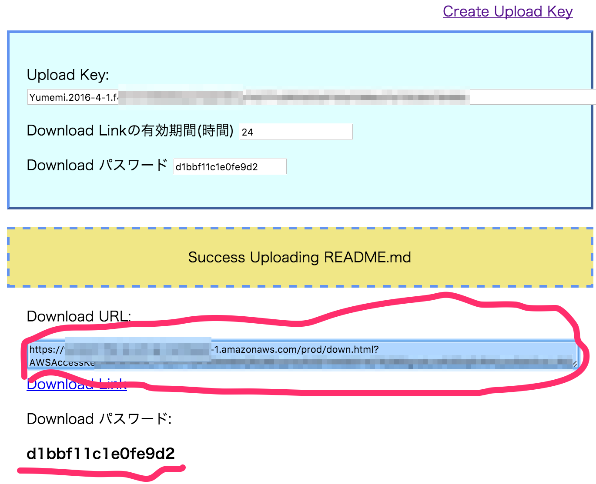

About
======================
This is a web service of sending file to other people.



Requirement
------------
* [JAWS Framework](https://github.com/jaws-framework/JAWS): 1.3.3
    * [Setup AWS Account For JAWS](https://github.com/jaws-framework/JAWS/blob/master/docs/account_setup.md)

Setup
============

Create S3 Bucket
-------------

Create S3 Bucket by AWS Web Console or CLI.

IAM User for S3
----------------

Create IAM User with the below policy.
The IAM User's API_KEY and API_SECRET is used in *Setup Environment Variables*. 

```
{
    "Version": "2012-10-17",
    "Statement": [
        {
            "Sid": "Stmt1445675708000",
            "Effect": "Allow",
            "Action": [
                "s3:PutObject",
                "s3:GetObject"
            ],
            "Resource": [
                "arn:aws:s3:::<YOUR S3 Bucket>/uploaded/*"
            ]
        }
    ]
}
```

Setup Environment Variables For JAWS
---------------

Setup env variables for JAWS like this.

```
jaws env set dev all <KEY> <VALUE>
```

KEY and Value are like these.

```.env.tmpl
JAWS_STAGE=dev
JAWS_DATA_MODEL_STAGE=dev
UPLOAD_API_KEY=<The IAM User API Key>
UPLOAD_API_SECRET=<The IAM User API Secret>
BUCKET_NAME=<YOUR S3 Bucket>
HASH_SECRET=YIZK3GMA6AQ                                 (Any String)
MASTER_SECRET=05650f64-7ac5-11e5-9d50-6c4008ba1de0      (Any String)
BUCKET_REGION=ap-northeast-1                            (Your Region)
```

JAWS Dash
-------------

Deploy all by `jaws dash` command.

```
jaws dash
```

Setup Environment Variables For Web Service
-------------------------------

* copy `public/env.js.tmpl` to `public/config/dev/env.js`
* edit the `env.js`

```env.js.tmpl
var Env = {
    API_BASE: 'https://YOURAPIID.execute-api.ap-northeast-1.amazonaws.com/<stage>',
    WEB_BASE: 'https://<BUCKET_NAME>.s3-ap-northeast-1.amazonaws.com/dev',
    DOWN_BASE: 'https://<BUCKET_NAME>.s3-ap-northeast-1.amazonaws.com/uploaded'
};

window.Env = Env;
```

Deploy HTML Resource
---------------

Use This Command

```
sh deploy_static_resource.sh
```


Setup CORS pre-flight Setting in API Gateway Console
--------------------

JAWS Framework does not support CORS pre-flight setting yet(maybe).
`createsessiontoken` API is used by POST method, so pre-flight OPTIONS method is requested by web browser.

Please check: https://github.com/jaws-framework/JAWS/issues/222


